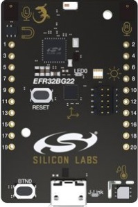

..
    Copyright 2020-2021 MicroEJ Corp. All rights reserved.
    This library is provided in source code for use, modification and test, subject to license terms.
    Any modification of the source code will break MicroEJ Corp. warranties on the whole library.

.. |BOARD_NAME| replace:: Thunderboard EFR32BG22
.. |BOARD_REVISION| replace:: A01
.. |PLATFORM_VER| replace:: 0.2.0
.. |RCP| replace:: MICROEJ SDK
.. |PLATFORM| replace:: MicroEJ Platform
.. |PLATFORMS| replace:: MicroEJ Platforms
.. |SIM| replace:: MicroEJ Simulator
.. |ARCH| replace:: MicroEJ Architecture
.. |CIDE| replace:: MICROEJ SDK
.. |RTOS| replace:: Micrium RTOS
.. |MANUFACTURER| replace:: Silicon Labs

.. _README MicroEJ BSP: ./efr32bg22_micriumos-bsp/projects/microej/README.rst
.. _RELEASE NOTES: ./RELEASE_NOTES.rst
.. _CHANGELOG: ./CHANGELOG.rst

==========================================
|PLATFORM| for |MANUFACTURER| |BOARD_NAME|
==========================================

This project is used to build a |PLATFORM| for the |BOARD_NAME|
development board.

Related Files
=============

This directory also contains:

* `CHANGELOG`_ to track the changes in the MicroEJ
  |BOARD_NAME| Platform
* `RELEASE NOTES`_ to list:

  - the supported hardware,
  - the known issues and the limitations,
  - the development environment,
  - the list of the dependencies and their versions.

* `README MicroEJ BSP`_ recommended for users familiar with the
  |MANUFACTURER| Gecko SDK and advanced usage on how to customize the build
  process.
  
Board Technical Specifications
==============================

.. list-table::

   * - Name
     - |BOARD_NAME|
   * - Revision
     - |BOARD_REVISION|
   * - MCU part number
     - EFR32BG22
   * - MCU revision
     - N/A
   * - MCU architecture
     - ARM Cortex-M33
   * - MCU max clock frequency
     - 76.8 MHz
   * - Internal flash size
     - 512 KB
   * - Internal RAM size
     - 32 KB
   * - Power supply
     - USB

Here is a list of |BOARD_NAME| useful documentation links:

- Board documentation available `here <https://www.silabs.com/documents/public/user-guides/ug415-sltb010a-user-guide.pdf>`__

Platform Specifications
=======================

The Architecture version is ``7.14.0``.

This Platform provides the following Foundation Libraries:

.. list-table::
   :header-rows: 1

   * - Foundation Library
     - Version
   * - BON
     - 1.4
   * - EDC
     - 1.3
   * - KF
     - 1.5
   * - SNI
     - 1.4
   * - TRACE
     - 1.1

The |PLATFORM| is derived into:

- a Mono-Sandbox Platform (default)
- a Multi-Sandbox Platform

Requirements
============

- PC with Windows 10
- Internet connection to `MicroEJ Central Repository <https://developer.microej.com/central-repository/>`_
- |RCP| Dist. ``20.12`` or higher, available `here <https://developer.microej.com/get-started/>`_
- |BOARD_NAME| board

Getting Started
===============

The EFR32BG22 `SDK Getting Started`_ explains how to start the SDK using the
MicroEJ reference implementation platform with the EFR32BG22 Thunderboard Kit.

.. _SDK Getting Started: https://developer.microej.com/getting-started-sdk-efr32bg22.html

BSP Setup
=========

Install Simplicity Studio version 5.1.2 or higher, available `here <https://www.silabs.com/developers/simplicity-studio/>`_

Open Simplicity Studio:

- ``Installation Manager`` should popup automatically.
- Plug in the |BOARD_NAME|.
- Select ``Install by connecting device(s)``. The connected board should be detected.
- Select ``Auto`` in the ``Package Installation Options`` window.
- Log in to be able to install all the recommended packages that Simplicity Studio suggest for the connected board.
- Go to ``Installation Manager`` again.
- Select ``Manage installed packages``.
- Go to ``SDKs``, select ``Version All``.
- Install ``Micrium OS - 5.9.2`` if not already installed.
- Install ``Gecko Platform - 3.0.2`` if not already installed.

Install IAR EmbeddedWorkbench version 8.50.9 or higher, available `here <https://www.iar.com/iar-embedded-workbench/>`_

Follow the instructions under *BSP setup* in `README MicroEJ BSP`_ .

BSP Compilation
---------------

The Platform provides a pre-compiled Mono-Sandbox Application.
Validate the BSP installation by compiling the BSP to build a MicroEJ
Firmware.

To build the ``efr32bg22_micriumos-bsp`` project, open a
terminal and enter the following command lines:

.. code-block:: sh

      $ cd "xxx/efr32bg22_micriumos-bsp/projects/microej/scripts"
      $ build.bat

The BSP project build is launched. Please wait for the final message:

.. code-block::

      Total number of errors: 0
      Total number of warnings: 0

The build script requires an environment vatiable IAREW_INSTALLATION_DIR to be set
to the IAR Embedded Workbench instalation path.

Please refer to `README MicroEJ BSP`_ for more details on how to
customize the build scripts.

Board Setup
===========

Please refer to the |MANUFACTURER| documentation available `here
<https://www.silabs.com/documents/public/user-guides/ug415-sltb010a-user-guide.pdf>`__
for more details.

Power Supply
------------

The board can be powered by USB cable or coin cell battery.

Programming
-----------

Please Follow the steps below:

- Connect the USB connector of the board to your computer
- Open a terminal and enter the following command lines:

.. code-block:: sh

      $ cd "xxx/efr32bg22_micriumos-bsp/projects/microej/scripts"
      $ run.bat

The firmware is launched. Please wait for the final message:

.. code-block::

      CSpyBat terminating.

Logs Output
-----------

MicroEJ platform uses the virtual UART from the |BOARD_NAME|
USB port.  A COM port is automatically mounted when the board is
plugged to a computer using USB cable.  All board logs are available
through this COM port.

The COM port uses the following parameters:

.. list-table::
   :widths: 3 2

   * - Baudrate
     - 115200
   * - Data bits bits
     - 8
   * - Parity bits
     - None
   * - Stop bits
     - 1
   * - Flow control
     - None

If flashed, the pre-compiled application outputs ``Hello World`` on
the UART.

When running a Testsuite, logs must be redirected to a secondary UART
port.  Please refer to `Testsuite Configuration`_ for a detailed
explanation.

Debugging
---------

A JTAG interface is also directly available through the USB interface.

Please refer to the `README MicroEJ BSP`_ section debugging for more
details.

Platform Setup
==============

Platform Import
---------------

Import the projects in |RCP| Workspace:

- ``File`` > ``Import`` > ``Existing Projects into Workspace`` >
  ``Next``
- Point ``Select root directory`` to where the project was cloned.
- Click ``Finish``

Inside |RCP|, the selected example is imported as several projects
prefixed by the given name:

- ``efr32bg22_micriumos-configuration``: Contains the
  platform configuration description. Some modules are described in a
  specific sub-folder / with some optional configuration files
  (``.properties`` and / or ``.xml``).

- ``efr32bg22_micriumos-bsp``: Contains a ready-to-use BSP
  software project for the |BOARD_NAME| board, including a
  |CIDE| project, an implementation of MicroEJ core engine (and
  extensions) port on |RTOS| and the |BOARD_NAME| board
  support package.

- ``efr32bg22_micriumos-fp``: Contains the board description and
  images for the MicroEJ Simulator. This project is updated once
  the platform is built.

- ``efr32bg22-Platform-CM4hardfp_IAR83-{version}``:
  Contains the |RCP| Platform project which is empty by default until
  the Platform is built.

Platform Build
--------------

To build the Platform, please follow the steps below:

- Right-click on ``efr32bg22_micriumos-configuration``
  project in your |RCP| workspace.
- Click on ``Build Module``

The build starts.  This step may take several minutes.  The first
time, the Platform build requires to download modules that are
available on the MicroEJ Central Repository.  You can see the progress
of the build steps in the MicroEJ console.

Please wait for the final message:

.. code-block::

                          BUILD SUCCESSFUL

At the end of the execution the |PLATFORM| is fully built for the
|BOARD_NAME| board and is ready to be linked into the |CIDE|
project.

The Platform project should be refreshed with no error in the |RCP|
``efr32bg22-Platform-CM4hardfp_IAR83-{version}``.

Please refer to 
https://docs.microej.com/en/latest/ApplicationDeveloperGuide/standaloneApplication.html
for more information on how to build a MicroEJ Standalone Application.

An evaluation license is needed for building an application. Please refer to
https://docs.microej.com/en/latest/overview/licenses.html#evaluation-license
for information on how to acquire and activate a license.

Testsuite Configuration
=======================

To run a Testsuite on the |BOARD_NAME| board the logs output must
be redirected using the 'Serial to Socket Transmitter' tool. 

In ``config.properties``, the property ``target.platform.dir`` must be
set to the absolute path to the platform.  For example
``C:/workspace/efr32bg22-Platform-CM4hardfp_IAR83-{version}/source``.

Please refer to the documentation available `here
<https://docs.microej.com/en/latest/Tutorials/tutorialRunATestSuiteOnDevice.html#configure-the-test-suite>`__
for more details.

Troubleshooting
===============

Files not found during the build
--------------------------------

Errors about files not found during the build may be caused by long
path.  Please refer to the known issues and limitations in the
`RELEASE NOTES`_ for a workaround.

